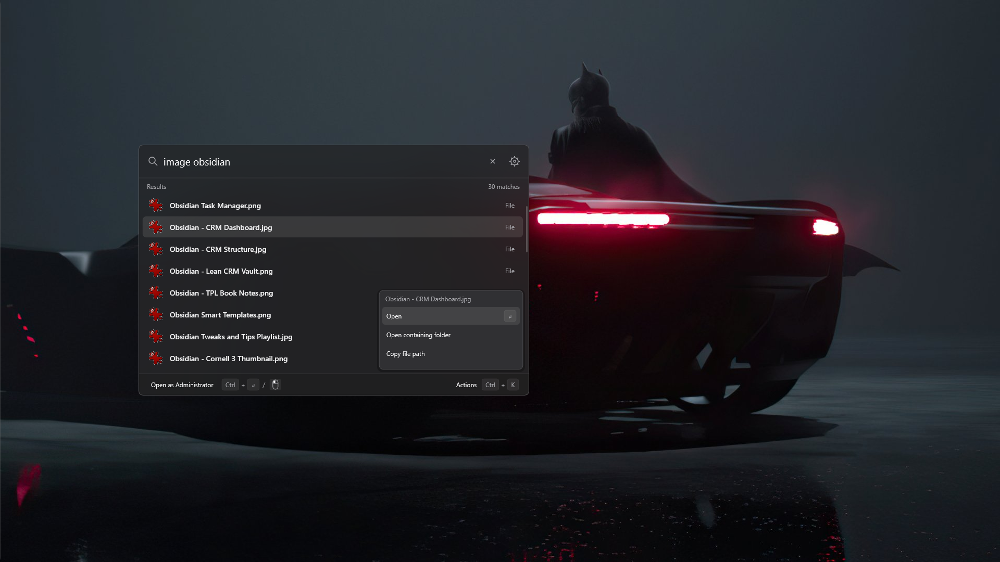

<h1 align="center">Lean Launcher</h1>

[](https://github.com/sdkasper/lean-launcher/blob/master/LICENSE)
[](#build-from-source)
[](#obsidian-integration)
[](https://github.com/sdkasper/lean-launcher/issues)

> Lean Launcher is an independent fork of [Takeoff](https://github.com/akiraeng/takeoff-launcher)
> by akiraeng, distributed under the same MIT license. See `LICENSE` for the full license text.

<p align="center">
  <strong>A focused, lightning-fast native Windows app launcher with optional Obsidian capture built in.</strong><br>
  Press <strong>Alt+Space</strong>, type what you need, and press <strong>Enter</strong>.
</p>

<p align="center">
  
</p>

<p align="center">
  <b>⚡ &lt; ~500 KB binary</b> &nbsp;&bull;&nbsp;
  <b>🧠 ~10 MB RAM</b> &nbsp;&bull;&nbsp;
  <b>🚀 &lt; 1 ms search</b> &nbsp;&bull;&nbsp;
  <b>🔒 Zero telemetry</b>
</p>

**Windows only.**

## Features

### Launcher Core

- **Ultra-Lightweight** - Built in pure C++, Win32, and Direct2D. No Electron, no Chromium runtime. The entire executable is ~500 KB and uses just ~10 MB RAM.
- **Instant Search** - In-memory indexing and weighted fuzzy matching return results in under a millisecond.
- **Smart Matching** - Finds apps by acronyms and prefixes: `vsc` → Visual Studio Code, `tm` → Task Manager, `wu` → Windows Update, `dev man` → Device Manager
- **System Tools Included** - Instantly launch Control Panel applets, Windows Settings, Device Manager, and Services alongside desktop apps.
- **Built-in Calculator** - Instantly evaluate mathematical expressions (e.g. `125 * 8`, `sqrt(144)`, `2^10`, `(10 + 20) * 3`). Press `Enter` to copy the result to the clipboard and close, or `Ctrl+C` to copy directly.
- **Keyboard-First** - Launch, elevate to admin (`Ctrl+Enter`), and trigger quick-launch slots (`Alt+1`-`8`) without touching your mouse.
- **Privacy First** - Zero telemetry, zero analytics, and zero background services. Search history is never written to disk.
- **About tab** - version, author, and a link to the GitHub repo, right from Settings.

### Obsidian Integration

Entirely optional and off by default until you point it at a vault.

- **Auto-detected vault picker** - reads Obsidian's own `obsidian.json` to find every vault on your machine; click (or press Enter on) the Obsidian Vault row in Settings to pick one from a dropdown list (mouse or Up/Down/Enter/Esc)
- **Quick task capture** (`t <text>`, default prefix) - appends `- [ ] <text>` to today's daily note and hides the launcher immediately. Obsidian is never opened or focused.
- **Quick note capture** (`a <text>`, default prefix) - appends a plain line (not a checkbox) to today's daily note, for anything that isn't a task
- **Instant note jump** (`o <text>`, default prefix) - fuzzy-matches note titles against a live-synced background index and opens the match via Obsidian's own CLI (not a hand-rolled URI, not a third-party plugin dependency)
- **Daily-note auto-detection** - reads the vault's own Daily Notes / Periodic Notes plugin config, so notes land exactly where Obsidian itself would put them; optional manual folder/format override available if auto-detection doesn't fit your setup
- **Fully configurable** - master "Enable Obsidian integration" toggle, a per-action enable toggle for each of the three actions above, and inline-editable prefix/result-label/preview text per action, right from Settings. Prefix-uniqueness validation stops you from configuring two actions with colliding prefixes.
- **Compact by default** - each action's settings collapse into a one-line summary; expanding one collapses whichever other was open

## Shortcuts

| Shortcut | Action |
| --- | --- |
| `Alt+Space` | Open or dismiss Lean Launcher |
| `Enter` | Launch application, copy calculation result, or run the selected Obsidian action |
| `Ctrl+Enter` | Run as administrator |
| `Alt+1` ... `Alt+8` | Quick-launch visible result |
| `Ctrl+C` | Copy selected text or calculation result |
| `Ctrl+K` | Open actions menu (copy path, copy calculation, admin, etc.) |
| `Escape` | Clear query or close |

*Hotkeys, and every Obsidian action's prefix, can be customized anytime from the in-app Settings (gear icon).*

### Obsidian Hotkeys

These aren't global hotkeys - they're prefixes you type in the launcher's search box, same as the built-in calculator. Each one can be renamed, disabled, or reassigned per-action from Settings; the table below shows the defaults.

| Prefix | Action | Requires Obsidian running? |
| --- | --- | --- |
| `t <text>` | Add a task (`- [ ] <text>`) to today's daily note | No |
| `a <text>` | Add a plain line to today's daily note | No |
| `o <text>` | Fuzzy-search note titles and open the match | Yes* |

**\*** Obsidian's CLI requires the app to be running to open the note. If it isn't, `o` launches Obsidian as part of that same command - but per [Obsidian's own docs](https://obsidian.md/help/cli), the app needs to actually be running for the command to complete, so on a cold start Lean Launcher waits up to 10 seconds for Obsidian to finish booting before giving up.

## How It Works

The launcher itself is unchanged from its Takeoff heritage: a direct Win32 message-loop app rendered with Direct2D/DirectWrite, no UI framework, no Electron. Settings persist to `HKCU\Software\LeanLauncher` - its own registry root, distinct from Takeoff's, so both can coexist on the same machine without collision (own window class, own single-instance mutex, own Start Menu shortcut).

**Pure launcher features (app/file/web search, calculator, system tools) never require Obsidian or the Obsidian CLI at all.** They work identically whether or not Obsidian integration is enabled.

**Obsidian integration** adds no runtime dependency on Obsidian being open for two of its three actions: vault and daily-note location are discovered by reading Obsidian's own config files (`obsidian.json`, `daily-notes.json`) once, then task/note capture (`t`, `a`) write directly to the note file on disk - Obsidian can be closed the whole time. Note jump (`o`) is the one action that does need Obsidian running: it hands off to `Obsidian.com`, the CLI bundled with every standard Obsidian desktop install (`%LOCALAPPDATA%\Obsidian\Obsidian.com`), to open the matched note - executed off the UI thread so a slow or cold Obsidian start never stalls the launcher. Per Obsidian's own CLI, if Obsidian isn't already running, the same `o` command launches it and waits up to 10 seconds for it to come up before giving up - `o` searches always return matches from the local index regardless, but opening one on a cold start can take a few seconds or, on a very slow machine, time out.

## Build from Source

```powershell
cmake -S . -B build -A x64
cmake --build build --config Release
```

The compiled binary will be at `build/Release/LeanLauncher.exe`.

Run the test suite:

```powershell
ctest --test-dir build -C Release
```

## Changelog

See [CHANGELOG.md](CHANGELOG.md) for release history.

## Feedback

Use this repo to report bugs, request features, or ask questions.

- [Report a Bug](https://github.com/sdkasper/lean-launcher/issues/new?assignees=&labels=bug&template=bug_report.md)
- [Request a Feature](https://github.com/sdkasper/lean-launcher/issues/new?assignees=&labels=enhancement&template=feature_request.md)
- [Report a Performance Issue](https://github.com/sdkasper/lean-launcher/issues/new?assignees=&labels=performance&template=performance_issue.md)
- [Ask a Question / Share Feedback](https://github.com/sdkasper/lean-launcher/discussions)

## License

Lean Launcher is open source under the [MIT License](LICENSE), retained byte-for-byte from the upstream [Takeoff](https://github.com/akiraeng/takeoff-launcher) project it was forked from.
