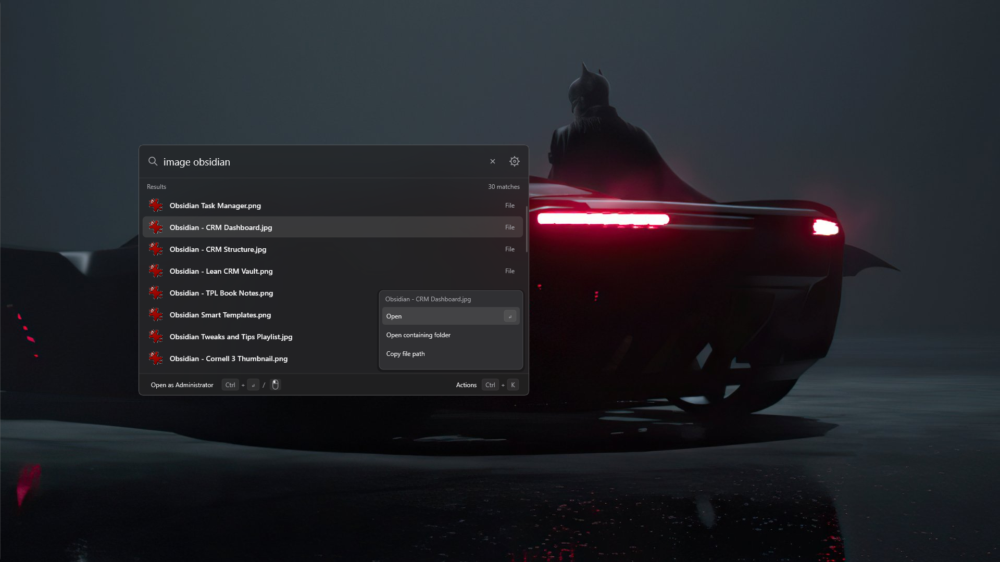

<h1 align="center">Lean Launcher</h1>

[](https://github.com/sdkasper/lean-launcher/releases)
[](#build-from-source)
[](#obsidian-integration)
[](https://github.com/sdkasper/lean-launcher/issues)
[](https://github.com/sdkasper/lean-launcher/issues?q=is%3Aissue+is%3Aclosed)
[](https://github.com/sdkasper/lean-launcher/releases)
[](https://github.com/sdkasper/lean-launcher/stargazers)
[](https://github.com/sdkasper/lean-launcher/blob/master/LICENSE)
[](https://discord.gg/sbMg6PP2vq)

> Lean Launcher is an independent fork of [Takeoff](https://github.com/akiraeng/takeoff-launcher)
> by akiraeng, distributed under the same MIT license. See `LICENSE` for the full license text.

<p align="center">
  <strong>A focused, lightning-fast native Windows app launcher with optional Obsidian capture built in.</strong><br>
  Press <strong>Alt+Space</strong>, type what you need, and press <strong>Enter</strong>.
</p>

<p align="center">
  
</p>

<p align="center">
  <b>⚡ &lt; 1 MB binary</b> &nbsp;&bull;&nbsp;
  <b>🧠 No Electron, no runtime</b> &nbsp;&bull;&nbsp;
  <b>🚀 &lt; 1 ms search</b> &nbsp;&bull;&nbsp;
  <b>🔒 Zero telemetry</b>
</p>

**Windows only.**

## Features

### Launcher Core

- **Ultra-Lightweight** - Built in pure C++, Win32, and Direct2D. No Electron, no Chromium runtime. The entire executable is under 1 MB. Memory depends on what it indexes: on a test machine with a large vault it used about 70 MB with file search off and about 130 MB with full-disk file search on. Turning File search off frees its index straight away.
- **Instant Search** - In-memory indexing and weighted fuzzy matching return results in under a millisecond.
- **Smart Matching** - Finds apps by acronyms and prefixes: `vsc` → Visual Studio Code, `tm` → Task Manager, `wu` → Windows Update, `dev man` → Device Manager
- **System Tools Included** - Instantly launch Control Panel applets, Windows Settings, Device Manager, and Services alongside desktop apps.
- **System commands** - type `lock`, `sleep`, `hibernate`, `restart`, `shut down`, `sign out`, or `empty recycle bin` (or `s ` to list them all, `s re` to narrow). Restart, shut down, sign out, and emptying the Recycle Bin ask for a second `Enter` first; the Recycle Bin row shows how many items it holds. Sleep and hibernate only appear if your PC supports them. Commands never show on the empty search box, can't be pinned, and never appear in recent items. Turn them off or change the `s` prefix in Settings > Tools.
- **Typed URLs** - type `https://...`, `www...`, or a bare address like `github.com/sdkasper` and press `Enter` to open it in your browser (bare addresses rank below your top match, so `readme.md` still finds the file). Only http and https are opened, and no URL history is kept.
- **Path completion** - type `C:\Us`, `%APPDATA%\Mi`, `~\Doc`, or `\\server\share\` to browse that folder right in the results; `Tab` completes, `Enter` opens, `Shift+Enter` opens the typed path. Folders load in the background, so an unreachable share never freezes the launcher.
- **Unit and time zone converter** - `5 km in mi`, `72 f to c`, `3 GB in GiB`, `time in Tokyo`, `10am PST in CET`. Offline, with daylight saving from Windows' own time zone rules.
- **Pomodoro timer** - `pomo 25 write intro` starts a focus timer with a tray reminder; finished timers are logged to today's note if it exists (the timer never creates a note or starts Obsidian).
- **Preview panel** - press `Ctrl+P` to show the selected note, text file, folder, or image beside the results, read straight from disk (Obsidian is never started, and nothing is written to disk). Notes get light formatting (larger bold headings, bullets, ☐/☑ checkboxes, bold/italic, `[[links]]` and `#tags` in the accent colour); any `.md` file shows this way. Long files show only the start, with a "Preview shows the start of the file" notice, since the panel reads at most 64 KB. Images show a thumbnail plus their dimensions and size below it. A long path wraps onto up to three lines under the title. Online-only cloud files show "Not downloaded - open to download" and are never downloaded. Scroll the panel with the mouse wheel or Shift+PgUp/PgDn; plain PgUp/PgDn still move through the results. On a narrow screen the panel shows as an overlay instead of widening the window. The panel stays open until you press `Ctrl+P` again; whether it's open is remembered between launches, though that isn't part of a settings export. Turn the panel, or its shortcut, off in Settings > Search.
- **Built-in Calculator** - Instantly evaluate mathematical expressions (e.g. `125 * 8`, `sqrt(144)`, `2^10`, `(10 + 20) * 3`). Press `Enter` to copy the result to the clipboard and close, or `Ctrl+C` to copy directly.
- **Keyboard-First** - Launch, elevate to admin (`Ctrl+Enter`), and trigger quick-launch slots (`Alt+1`-`8`) without touching your mouse.
- **Privacy First** - Zero telemetry, zero analytics, and zero background services (with the opt-in Snippets feature off, which is the default; see the privacy note under Snippets). Search history is never written to disk.
- **Pinned results** - pin up to 5 apps, files, or folders from the actions menu (`Ctrl+K` → Pin). Pins stay at the top of the empty search box and jump to the top whenever they match what you type.
- **Snippets (text expander)** - opt-in and off by default: turn it on in Settings > Snippets. Type a trigger such as `:sig` in any app and it is replaced by your text. Snippets live in a file, `%APPDATA%\LeanLauncher\snippets.yml` (a commented starter with two samples is created the first time you turn it on; "Edit snippets" in Settings opens it). The format is an Espanso-compatible subset: a `matches:` list where each entry has `trigger`, `replace`, and an optional `label`; write multi-line text with a `|` block or `\n` in quoted text. Variables, `word`, several `triggers` per entry, and other Espanso features are not supported yet, and entries that use them are skipped with a warning shown in Settings. Limits: file 1 MB, 5,000 snippets, replacement 64 KB, trigger 2-32 characters without spaces. If one trigger is the start of a longer one, the shorter one fires first. Short single-line text is typed. Long or multi-line text is pasted only when the clipboard is empty or holds only plain text (the clipboard is then restored afterwards and the pasted text is kept out of Windows clipboard history); otherwise it is typed key by key, and a multi-line snippet typed this way sends Enter for each line, so editors with auto-indent may re-indent it (tip: use short single-line snippets, or avoid having rich text such as a copied web page on the clipboard, if that matters). Search your snippets from the launcher with the `,` prefix: type `, ` followed by part of a label (`, sig`) and press `Enter` to insert into the window you came from, or to copy it to the clipboard if there is none. "Import from Espanso" in Settings asks first, saves a timestamped backup of your snippets file, adds the static matches from `%APPDATA%\espanso\match`, skips entries with variables, and never turns the feature on. Settings export and import never include or turn on the Snippets toggle. **Privacy:** while Snippets is on, a keyboard listener sees what you type in order to spot triggers, keeps at most the last 32 characters in memory only, and never stores or sends them; turning Snippets off removes the listener completely. It cannot see into or type into windows running as administrator, and may not work in some games or remote desktop windows. Known limits: a mouse click that moves the caret inside the same window does not reset the typed text (a rare false expansion is possible); password fields still expand; triggers are case-sensitive (Caps Lock changes the typed character); type the last trigger character and release it before the next key, since a fast rollover cancels the expansion; if expansions ever stop working (Windows removes hooks that answer too slowly), turn Snippets off and on again.
- **Settings tabs** - Settings is split into six tabs: **General** (shortcuts, run at startup, tray icon, and **Export settings... / Import settings...** to move your setup to another PC - an import shows what will change before applying and keeps a backup of your old settings), **Search** (file and web search, prefixes, exclusions, preview panel), **Tools** (unit and time zone converters, typed URLs, path completion, system commands, Pomodoro), **Snippets**, **Obsidian**, and **About**. Each tab groups its rows into titled cards, so nothing needs a long scroll.
- **About tab** - version, author, a link to the GitHub repo, and how many files and vault notes are currently indexed, right from Settings. The **Updates** card holds the "Check on startup" toggle and a **Check now** row that checks GitHub on demand (even with automatic checks off); when a newer release has downloaded, a second click installs it and restarts. If Lean Launcher is installed in a protected folder such as Program Files, Windows asks for administrator permission once, and the update is checked against the checksum published on GitHub before it is installed. Versions up to 1.9.0 cannot do this, so download 1.9.1 manually once in that case.

### File Search

- **Full-disk coverage** - indexes every fixed and removable drive with no file-count cap, so results aren't limited to a handful of common folders
- **Fast first run, instant restarts** - the first index is a one-time walk; after that, a persisted cache loads instantly on startup, followed by a quick incremental rescan that only re-checks folders that actually changed
- **Stays current automatically** - a periodic incremental rescan picks up new/changed/deleted files, and unplugging a removable drive prunes its files from search until it's reconnected
- **User-configurable exclusions** - add your own folder or file-extension exclusions on top of the built-in skip-list from Settings > Search ("Edit exclusions..."), for things like a large personal archive you never want to search

### Obsidian Integration

Entirely optional and off by default until you point it at a vault.

- **Auto-detected vault picker** - reads Obsidian's own `obsidian.json` to find every vault on your machine; click (or press Enter on) the Obsidian Vault row in Settings to pick one from a dropdown list (mouse or Up/Down/Enter/Esc)
- **Quick task capture** (`t <text>`, default prefix) - appends `- [ ] <text>` to today's daily note (or your task target note) and hides the launcher immediately. Obsidian is never opened or focused.
- **Quick note capture** (`a <text>`, default prefix) - appends a plain line (not a checkbox) to today's daily note (or your note target), for anything that isn't a task
- **Quick log capture** (`l <text>`, default prefix) - inserts a timestamped line (`- HH:MM: <text>`) at the end of a configured heading's section (default `## Log`) in today's daily note (or your log target note), for a running log without opening Obsidian
- **Capture target notes** - optionally send tasks, notes, or log entries to a specific note (e.g. `Inbox/Tasks`) instead of the daily note, set per action in Settings
- **Multi-line captures** - type `\n` or ` // ` in a `t`, `a`, or `l` capture to start a new line (`t buy milk // oat, 1 litre`), or paste multi-line text. Extra lines of a task or log entry are indented under its bullet so it stays one list item; the preview shows each break as `⏎`. Type `\\n` for a literal `\n` (e.g. `C:\\notes`); a `\n` or ` // ` inside pasted text also starts a new line. Markdown links, `[[wiki links]]`, and URLs are written exactly as typed.
- **Instant note jump** (`o <text>`, default prefix) - fuzzy-matches note titles against a live-synced background index and opens the match via Obsidian's own CLI (not a hand-rolled URI, not a third-party plugin dependency)
- **Quick open** (`o .`) - opens today's daily note in Obsidian, or one of your capture target notes if you choose that in Settings
- **Daily-note auto-detection** - reads the vault's own Daily Notes / Periodic Notes / Journals plugin config (whichever is actually enabled, including plugins started by the Lazy Plugin Loader), so notes land exactly where Obsidian itself would put them; optional manual folder/format override available if auto-detection doesn't fit your setup. Date formats support `YYYY YY MMMM MMM MM M DD D dddd ddd` and `[literal text]` (English month/weekday names). If today's note doesn't exist yet, Lean Launcher creates it without your daily-note template - open it in Obsidian first if you want the template applied
- **Fully configurable** - master "Enable Obsidian integration" toggle, a per-action enable toggle for each of the four actions above, and inline-editable prefix/result-label/preview text per action, right from Settings. Prefix-uniqueness validation stops you from configuring two actions with colliding prefixes.
- **Compact by default** - each action's settings collapse into a one-line summary; expanding one collapses whichever other was open

## Shortcuts

| Shortcut | Action |
| --- | --- |
| `Alt+Space` | Open or dismiss Lean Launcher |
| `Enter` | Launch application, copy calculation result, or run the selected Obsidian action |
| `Ctrl+Enter` | Run as administrator |
| `Alt+1` ... `Alt+8` | Quick-launch visible result |
| `Ctrl+C` | Copy selected text or calculation result |
| `Ctrl+K` | Open actions menu (copy path, copy calculation, admin, etc.) |
| `Ctrl+P` | Toggle the preview panel |
| `Escape` | Clear query or close |

*Hotkeys, and every Obsidian action's prefix, can be customized anytime from the in-app Settings (gear icon).*

### Obsidian Hotkeys

These aren't global hotkeys - they're prefixes you type in the launcher's search box, same as the built-in calculator. Each one can be renamed, disabled, or reassigned per-action from Settings; the table below shows the defaults.

| Prefix | Action | Requires Obsidian running? |
| --- | --- | --- |
| `t <text>` | Add a task (`- [ ] <text>`) to today's daily note or task target note | No |
| `a <text>` | Add a plain line to today's daily note or note target | No |
| `l <text>` | Add a timestamped log line to a configured heading's section in today's daily note | No |
| `o <text>` | Fuzzy-search note titles and open the match | Yes* |
| `o .` | Open today's daily note (or a chosen capture target note) | Yes* |
| `, <text>` | Search your snippets by label and insert the match (needs Snippets turned on in Settings) | No |

**\*** Obsidian's CLI requires the app to be running to open the note. If it isn't, `o` launches Obsidian as part of that same command - but per [Obsidian's own docs](https://obsidian.md/help/cli), the app needs to actually be running for the command to complete, so on a cold start Lean Launcher waits up to 10 seconds for Obsidian to finish booting before giving up.

## How It Works

The launcher itself is unchanged from its Takeoff heritage: a direct Win32 message-loop app rendered with Direct2D/DirectWrite, no UI framework, no Electron. Settings persist to `HKCU\Software\LeanLauncher` - its own registry root, distinct from Takeoff's, so both can coexist on the same machine without collision (own window class, own single-instance mutex, own Start Menu shortcut).

**Pure launcher features (app/file/web search, calculator, system tools) never require Obsidian or the Obsidian CLI at all.** They work identically whether or not Obsidian integration is enabled.

**Obsidian integration** adds no runtime dependency on Obsidian being open for three of its four actions: vault and daily-note location are discovered by reading Obsidian's own config files (`obsidian.json`, `daily-notes.json`) once, then task/note/log capture (`t`, `a`, `l`) write directly to the note file on disk - Obsidian can be closed the whole time. Note jump (`o`) is the one action that does need Obsidian running: it hands off to `Obsidian.com`, the CLI bundled with every standard Obsidian desktop install (`%LOCALAPPDATA%\Obsidian\Obsidian.com`), to open the matched note - executed off the UI thread so a slow or cold Obsidian start never stalls the launcher. Per Obsidian's own CLI, if Obsidian isn't already running, the same `o` command launches it and waits up to 10 seconds for it to come up before giving up - `o` searches always return matches from the local index regardless, but opening one on a cold start can take a few seconds or, on a very slow machine, time out.

## Build from Source

Run these from a **VS Developer Command Prompt** (or after calling `vcvars64.bat`) so `cmake`/`msbuild` can find the MSVC toolchain.

```powershell
cmake -S . -B cmake -A x64
cmake --build cmake --config Release
```

The compiled binary will be at `cmake/Release/LeanLauncher.exe`.

Run the test suite:

```powershell
ctest --test-dir cmake -C Release
```

## Changelog

See [CHANGELOG.md](CHANGELOG.md) for release history.

## Feedback

Use this repo to report bugs, request features, or ask questions.

- [Report a Bug](https://github.com/sdkasper/lean-launcher/issues/new?assignees=&labels=bug&template=bug_report.md)
- [Request a Feature](https://github.com/sdkasper/lean-launcher/issues/new?assignees=&labels=enhancement&template=feature_request.md)
- [Report a Performance Issue](https://github.com/sdkasper/lean-launcher/issues/new?assignees=&labels=performance&template=performance_issue.md)
- [Ask a Question / Share Feedback](https://github.com/sdkasper/lean-launcher/discussions)

## License

Lean Launcher is open source under the [MIT License](LICENSE), retained byte-for-byte from the upstream [Takeoff](https://github.com/akiraeng/takeoff-launcher) project it was forked from.

If you like my work and want to support me, you can do so [here](https://kspr.me/cheers).

> [!WARNING]
> **Windows Defender may flag `LeanLauncher.exe` as a threat (e.g. `Trojan:Script/Sabsik.EN.A!ml` or `Behavior:Win32/Persistence.A!ml`) on first run.** This is a false positive, not an actual detection of malicious code - the release build isn't code-signed yet, and Defender's cloud heuristics are cautious about new, unsigned, low-download-count executables, especially ones (like the built-in updater) that replace their own binary in place or register themselves to start with Windows. Since v1.6.1, **Run at startup** is off by default and only turned on when you enable it in Settings. The source is fully open in this repo if you want to verify. If you hit this:
> - Click **"Actions" > "Allow on device"** (or **"Restore"**) in the Windows Security notification, or
> - Right-click the downloaded `.exe` or `.zip` > **Properties** > check **"Unblock"** > OK, or
> - Add a Defender **exclusion** for the install folder (Windows Security > Virus & threat protection > Manage settings > Exclusions).
>
> Code signing is planned to resolve this permanently - see [CHANGELOG.md](CHANGELOG.md) for status.
